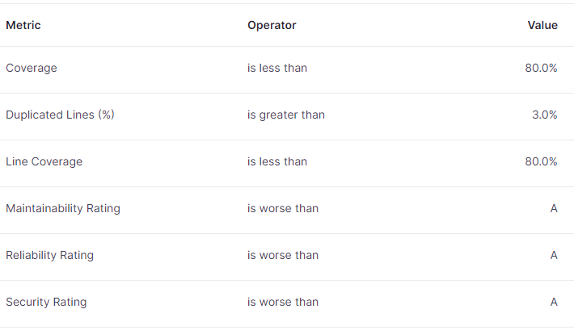
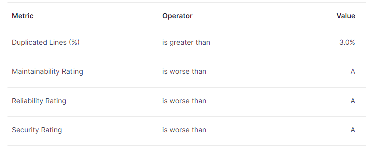

# CodeMetropolis
## Introduction  
This documentation is designed to help new developers and team members to understand how
the project is developed and maintained.

## Table of Contents
1. [Getting Started](#getting-started)
   1. [Prerequisites](#prerequisites)
   2. [Install the Codebase](#install-the-codebase)
2. [Development Process](#development-process)
   1. [Merge to Develop Process](#general-development-process)
   2. [Development Process Diagram](#development-process-diagram)
   3. [Pull Request](#pull-request)
   4. [Branch Types](#branch-types)
   5. [Branching Strategy](#branching-strategy)
   6. [Commits](#commits)
3. [Quality Gates](#quality-gates)
   1. [Testing](#testing)
   2. [CheckStyle](#checkstyle)
   3. [Pre-commit Hook](#pre-commit-hook)
   4. [SonarQube](#sonarqube)
   5. [JaCoCo](#jacoco)
4. [CI/CD](#cicd)
   1. [Pipeline Steps](#pipeline-steps)

## Getting Started
### Prerequisites
* Download and install Java 1.8 version: https://www.openlogic.com/openjdk-downloads
* Download and install Maven 3.8.3 or newer: https://maven.apache.org/download.cgi
* Download and install Git: https://git-scm.com/downloads
* Download and install Python: https://www.python.org/downloads/
* (Optional) Download and install any Java IDE (e.g., IntelliJ, Eclipse, etc.) 

### Install the Codebase
1. Clone the repository into a directory of your choice:
   * ```git clone https://github.com/codemetropolis/CodeMetropolis.git```
2. Checkout the develop branch:
   * ```git checkout develop```
3. Navigate to the 'sources' folder:
   * ```cd sources```
4. Install the code:
   * ```mvn clean install -DskipTests```

## Development Process
### General Development Process
1. Create the code change that is required for the new feature (feature implementation, JUnit and Python tests,
    documentation (JavaDoc), etc.) considering the [Conventional Commits](#commits) specification
2. Push these commits to the remote [feature branch](#branch-types)
3. Open a [Pull Request](#pull-request)
4. Set the [base branch to the develop branch, the compare branch to the feature branch](#branching-strategy)
5. Fill in the description according to the predefined pull request template
6. Assign at least `1` reviewer(s) to the pull request to review it
7. The reviewer(s) review(s) the code, the description
8. If a reviewer identifies issues with the pull request, then these issues should be raised by commenting on the pull request
9. The owner of the pull request addresses these issues and makes the necessary changes
10. The reviewer(s) review(s) these changes and resolves the conversations
11. If there are no more open conversations, then the developer executes the [manual tests](#testing)
12. The developer attaches evidences of the executed manual tests
13. The developer creates/updates the feature documentation on the [CodeMetropolis homepage](https://codemetropolis.github.io/CodeMetropolis/)
14. Meanwhile, the [CI/CD pipeline](#cicd) has been started automatically
15. The following conditions should be met before approving the pull request:
    * The reviewer(s) reviewed the code, all conversations have been resolved
    * The description is filled in properly
    * Feature documentations are created/updated
    * Manual tests are passed
    * All the checks are passed on the pull request
16. The reviewer(s) approve(s) the pull request
17. The developer clicks on the Squash and Merge button
18. (Optional) The developer deletes the feature branch

### Development Process Diagram


### Pull Request
The developer must create a pull request in order to merge back the new code
into the target branch.
1. Create a pull request on the [CodeMetropolis GitHub page](https://github.com/Conilzze0/CodeMetropolis)
2. Set the branches accordingly, select the branch where you want to merge from,
and the target branch you want to merge into
3. Fill in the description with the following:
   * Detailed information about the problem or the added new function
   * List of dependencies if there are any
   * The possible effects on another function which is caused by this code change
   * List of reviewers
   * Link of the updated feature documentation
   * Evidence of manual tests run
4. Set up at least `1` reviewer who can review the code change
5. Submit the pull request
6. The reviewer has to review the code, can add comments, make suggestions
7. The pull request can be merged if:
   * All comments are addressed and resolved
   * The reviewers approved the pull request
   * All checks have passed
   * Feature documentation is created/updated on the [CodeMetropolis homepage](https://codemetropolis.github.io/CodeMetropolis/)
   * Evidence that all manual tests have been successfully executed is attached
8. Use squash and merge

### Branch Types
* `master`  
    The main branch, contains the complete production-ready code.
* `develop`  
    Development branch, continuous development is happening on this branch. Developers
    can merge their feature branches into this branch.
* `feature/<feature_name>`  
    These branches contain new function, test implementation and documentation commits.

### Branching Strategy


### Commits
In our project, we follow the **Conventional Commits** specification when writing commit messages. 
[Conventional Commits](https://www.conventionalcommits.org/en/v1.0.0/) provide a structured and standardized way of documenting changes,
making it easier to understand and manage the commit history.
Each commit message should look like the following format: 
`<type>: <description>`
* `<type>`: Indicates the purpose of the commit. The following types should be used:
  * "feat" for feature implementation, these commits contain the necessary code changes for the new feature
  * "test" for test implementation, changes regarding JUnit and/or Python tests
  * "docs" for documentation update, this should include JavaDoc at least for the public methods, and feature documentation
  * Other types can be used if needed: "build", "fix", "ci", etc. Please see the [Conventional Commits](https://www.conventionalcommits.org/en/v1.0.0/)
  documentation for more info.
* `<description>`: A clear, brief description of the change.

Examples:  
* `feat: implement a new renderer method to make the rendering tool faster`
* `test: implement new tests for the rendering tool`
* `docs: add javadoc to the added public methods`

## Quality Gates
### Testing
This project contains **JUnit** tests to ensure the correctness of the codebase and **functional Python tests**
to validate end-to-end scenarios and ensure that the application works as expected.
* The **JUnit** tests can be found in the `src/test` directory of each tool and can be
  executed by running the following command:  
  ```mvn test```
* The **functional Python testing** framework can be found in the `sources/test` directory.  
To use this framework, execute the `CodeMetropolis Tester Interface.py` script, which
opens a graphical user interface where the developer can run the functional tests.
* There are **manual tests** defined for the project that cover the functionalities of each tool.
  * These tests can be found here: [CodeMetropolis GitHub page -> wiki -> Testing](https://github.com/codemetropolis/CodeMetropolis/wiki/Testing)
  * All manual tests should be executed before merging our features to the `develop` branch
    and the evidence should be attached to the pull request description.

### CheckStyle
The project contains CheckStyle integration to make sure that high quality code
is created during implementation. 
* These code quality standards are described in `rules/checkstyle_rules.xml` file
* To check that the code satisfies these standards, you can run the following:  
  ```mvn checkstyle:check```

### Pre-commit Hook
There is a predefined pre-commit git hook available for the project. If installed, this script
will execute before each commit action, and runs a code quality check ONLY on the modified java files.  
* To install this pre-commit hook, simply copy the `pre-commit` (without file extension) file from the rules
directory to the local git repository's `.git/hooks/` directory.

### SonarQube
CodeMetropolis also has a SonarQube integrated to improve the quality of the codebase.  
SonarQube report generation is triggered when a pull request is created.
* SonarCloud has been configured to visualize these details, which can be accessed here:
https://sonarcloud.io/summary/overall?id=Conilzze0_CodeMetropolis
* The following quality gates has been set for this project:
  * Early-Development **(default, currently active)**, conditions on new code  
    
    * These conditions are checked only on new code.
    * We should aim at **80%** of general code coverage to ensure the correctness of the code.
    * There shouldn't be more than **3%** duplicated lines in our code to avoid too much duplication.
    * **80%** of our new lines should be covered with tests.
    * To keep our code easy to maintain, we should aim at an **A** rating for Maintainability
      * This metric takes into account factors such as code complexity, redundancy, coding style,
      the presence of comments, and other elements.
    * We will need an **A** rating for Reliability.
      * This metric focuses on issues, exceptions, and security problems that may occur during 
      code execution.
    * We want to make sure that our code is resistant to security threats and attacks, so an **A**
      Security Rating has been set to this profile.
      * This metric identifies security vulnerabilities that could be exploited within the code.
  * Early-Development **(default, currently active)**, conditions on overall code
    
    * Currently, it's pointless to measure general and line coverage for the overall code, since the current
      overall test coverage is minimal.
    * The remaining conditions are set to the same values as for the new code.
  * Late-Development
    * This quality gate should be activated once the development is at a stage where the overall code has been refactored
    and has been covered with enough tests so the metrics will at least come close to our target conditions.
    * The new code and the overall code conditions setup is pretty much the same as in the Early-Development profile,
    with the difference that Coverage and Line Coverage both set to at least **80%** for the overall code.

### JaCoCo
JaCoCo is also available to help developers determine how much the code is covered with automated tests.  
* To use this tool, run the following command:
  `mvn clean verify`
* After the execution, a report is generated under the `sources/report-aggregate/target/site/jacoco-aggregate` directory
* To view the report, start a web server and open the `index.html`
  * In IntelliJ, you can right-click on the `index.html` file -> Open In -> Browser and select your favourite browser

## CI/CD
This project is equipped with Continuous Integration and Continuous Deployment pipeline to ensure
the quality, reliability and maintainability of the codebase.

### Pipeline Steps
1. **Automated Maven Build**
   * The CI/CD pipeline begins with an automated Maven build triggered by GitHub Actions
   whenever new code is pushed or a pull request is created.
   * During the build process, JUnit tests are also executed. 
2. **Functional Python Tests**
   * The pipeline includes functional Python tests to ensure overall functionality.
3. **Checkstyle**
   * During the Maven build the Checkstyle plugin is also triggered to make sure that high quality code
     is created during implementation.
   * The job is configured in a way that only the modified `.java` files are checked.
4. **JacCoCo Code Coverage**
   * Jacoco performs code coverage analysis to determine the code test coverage.
   * The generated report is sent to SonarQube.
5. **SonarQube**
   * Provides advanced code analysis, identifies code smells, bugs and security vulnerabilities.
   * SonarQube also calculates technical dept, helping us prioritize improvements and maintain a healthy codebase.
   * The tool is connected to SonarCloud to visualize the reports generated by SonarQube.
   * Conditions are defined for both **New and Overall code** on [SonarCloud](https://sonarcloud.io/project/overview?id=Conilzze0_CodeMetropolis)
        

The reports generated by the tools listed above are attached to each pull request.
